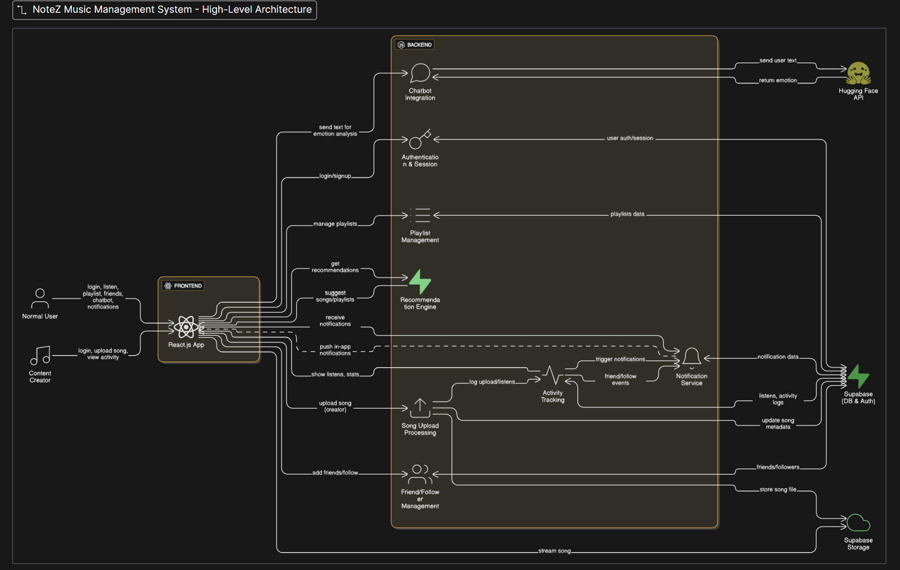

# NoteZ

A full-stack music streaming platform with social features and an AI-powered mood recommender. NoteZ uses Supabase for authentication and data storage, an Express backend (REST API), and a React + Vite frontend.

---

## Table of Contents
- [Overview](#overview)
- [Features](#features)
- [Tech Stack](#tech-stack)
- [Project Structure](#project-structure)
- [Setup](#setup)
- [Environment Variables](#environment-variables)
- [Usage](#usage)
- [Testing](#testing)
- [Deployment](#deployment)
- [Security](#security)
- [Architecture](#architecture)
- [Future Improvements](#future-improvements)
- [License](#license)

---

## Overview

NoteZ is a music streaming application designed for everyday listeners and content creators. It provides authenticated streaming, playlist management, social interactions (friends/follows and notifications), and an AI DJ that suggests songs based on a user’s mood. The platform is intended as a developer-friendly reference app using Supabase and modern TypeScript tooling.

---

## Features

Core features (user-facing)
- User authentication and profiles (email auth via Supabase)
- Upload and stream songs (Supabase Storage)
- Playlists (public/private) and a built-in Favorites playlist
- Like/favorite songs and manage a personal library
- Follow and friend system with friend requests
- In-app notifications
- Listening history and basic analytics

Creator features
- Upload songs with metadata
- Creator dashboard for basic analytics and song management

AI features
- AI DJ Assistant: accepts a short text describing mood and returns a detected emotion, recommended categories, and suggested songs. Uses Hugging Face when available; falls back to a keyword detector when inference is not reachable.

Developer features
- REST API (Express) with routes for auth, songs, playlists, favorites, friends, recommendations, and AI endpoints

---

## Tech Stack

### Frontend
- React (TypeScript)
- Vite
- Tailwind CSS
- React Router
- @tanstack/react-query
- Supabase JS client

### Backend
- Node.js (18+)
- Express
- @supabase/supabase-js
- JWT for app tokens
- Multer (file uploads), Helmet, compression, rate-limiting

### Database / Services
- Supabase (Postgres with RLS, Auth, Storage)
- Optional: Hugging Face API for emotion detection

---

## Project Structure

Top-level layout (tests omitted for brevity):

```
notez/
├── backend/            # Express API, Supabase config, migrations
├── frontend/           # React app (Vite + TypeScript)
├── DETAILS/            # Design docs, guides, and READMEs
├── public/             # Static assets for frontend
├── package.json        # Workspace scripts
└── README.md           # This file
```

If you prefer, I can also add short `README.md` files inside `backend/` and `frontend/` that focus only on local development steps.

---

## Setup

### Prerequisites
- Node.js 18+ and npm
- A Supabase project (URL and service role key)

### Install and run locally
1. Clone and install:

```bash
git clone <your-repo-url>
cd notez
npm run install:all
```

2. Create env files
- Backend: create `backend/.env` with required variables (listed below)
- Frontend: create `frontend/.env` with required variables (listed below)

3. Initialize database
- Run the SQL in `backend/supabase/schema.sql` in your Supabase project (or apply migrations in `backend/supabase/migrations/`).

4. Start servers
- Start both in one command (monorepo):

```bash
npm start
```

- Or run individually:

```bash
# frontend
cd frontend && npm run dev
# backend
cd backend && npm run dev
```

Default ports:
- Frontend: http://localhost:5173
- Backend: http://localhost:3001

---

## Environment Variables

Backend (`backend/.env`)

- PORT (optional, default 3001)
- NODE_ENV (development|production)
- JWT_SECRET (app JWT signing key)
- FRONTEND_URL (for CORS, e.g. http://localhost:5173)
- SUPABASE_URL (Supabase project URL)
- SUPABASE_SERVICE_ROLE_KEY (service role key)
- HUGGINGFACE_API_KEY 
- HUGGINGFACE_MODEL_EMOTION (optional model override)
- HUGGINGFACE_MODEL_SENTIMENT (optional model override)

Frontend (`frontend/.env`)
- VITE_SUPABASE_URL
- VITE_SUPABASE_ANON_KEY

Storage buckets expected in Supabase:
- `songs` — audio files and album covers
- `avatars` — profile images

Keep secrets out of source control.

---

## Usage

- Register or log in via the frontend and start streaming.
- Use the Library to view playlists and the Favorites playlist (special handling in the app).
- The AI DJ Assistant accepts a short text prompt and returns: `emotion`, `categories`, and `suggestions`.
  - Response includes `detectionSource` indicating `huggingface-emotion`, `huggingface-sentiment`, or `keyword` (fallback).

---


## Deployment

- Build frontend: `cd frontend && npm run build`
- Backend: set `NODE_ENV=production`, ensure `JWT_SECRET` and Supabase credentials are set.
- Use separate Supabase projects for staging/production and configure CORS/origins.

---

## Security

- The app uses Supabase (Postgres) and is designed to work with Row Level Security (RLS) — validate RLS policies before production deployment.
- Do not commit `JWT_SECRET`, Supabase service role keys, or any other secrets.

---

## Architecture

An architecture diagram illustrates the frontend, backend, Supabase services, and AI flow. I can add the diagram you attached to the repository at `docs/architecture.png` and embed it below.

<p align="center">
  
</p>

---

## Future Improvements

- Add more robust AI model configuration and fallbacks
- Add E2E tests and CI workflows
- Improve monitoring for backend and AI call reliability

---